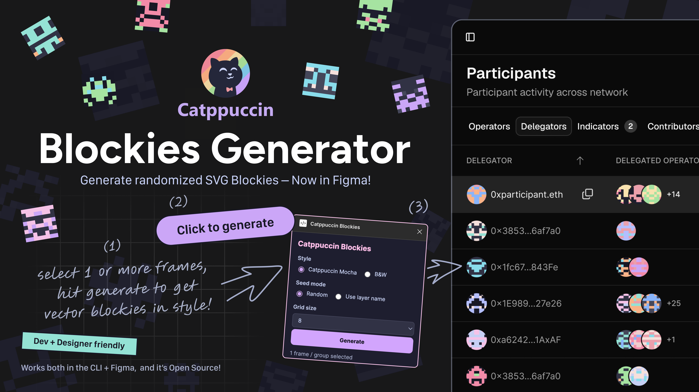
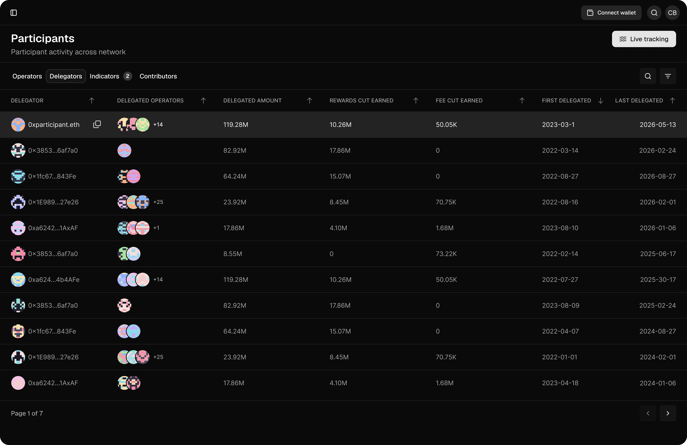

# Catppuccin Blockies Generator



Generate minimal Ethereum-style PNG and SVG blockies/identicons for dashboards, wallets, and interface mockups, including Catppuccin Mocha and black-and-white outputs.

This started as a small design utility for placeholder wallet avatars and identity icons while working on crypto/web3 dashboards. It now includes both a CLI generator and a Figma Community plugin.

## Figma Plugin

Use the Figma plugin to generate editable vector blockies directly inside your Figma file.

Install from Figma Community:
[Catppuccin Blockies on Figma Community](https://www.figma.com/community/plugin/1637206310954646633/catppuccin-blockies)



How it works:

1. Select one or more frames or groups in Figma.
2. Choose **Catppuccin Mocha** or **Black & White**.
3. Choose random seeds or layer-name seeds.
4. Generate native rectangle-based vector blockies inside the selected layers.

Demo video:
[Catppuccin Blockies Figma plugin demo](https://pub-bcc6d2313b944bc1945a7e7013ae2321.r2.dev/catppuccin-blockies/demo.mp4)

### Local development

To build the Figma plugin locally:

```bash
cd figma-plugin
npm install
npm run build
```

Then import `figma-plugin/manifest.json` in Figma via **Plugins → Development → Import plugin from manifest…**.

## CLI Usage

Install dependencies from the repo root:

```bash
npm install
```

Generate a batch of Catppuccin-themed PNG and SVG blockies:

```bash
npm run generate
```

Generate one Catppuccin Mocha PNG and SVG blockie:

```bash
npm run generate:single
# or with a deterministic seed/address/string
node generate-blockie.js 0x1234567890abcdef1234567890abcdef12345678
```

Generate one black-and-white PNG and SVG blockie:

```bash
npm run generate:bw
# or with a deterministic seed/address/string
node generate-bw-blockie.js 0x1234567890abcdef1234567890abcdef12345678
```

## CLI Output

- `npm run generate` writes timestamped Catppuccin Mocha batch PNG and SVG
  files to `./generated-blockies/`.
- `npm run generate:single` writes timestamped Catppuccin Mocha files like
  `./generated-blockies/blockie-single_YYYYMMDDHHMMSS.png` and `.svg`.
- `npm run generate:bw` writes timestamped black-and-white files like
  `./generated-blockies/blockie-bw_YYYYMMDDHHMMSS.png` and `.svg`.

Generated outputs are ignored by Git by default.

## Notes

Wallet/address-looking values in the examples are dummy seeds only. They are used to produce deterministic visual output and are not intended to represent a real wallet.
If no seed/address is provided, the single-output scripts generate a random Ethereum-style seed/address and print it.

This tool creates visual identicons only. It does not validate wallet ownership, verify addresses, or perform any blockchain lookups.

## Attribution

This is an unofficial tool inspired by the Catppuccin Mocha color palette.
Catppuccin is created by the Catppuccin community.

This project is not affiliated with or endorsed by the official Catppuccin
organization.

## License

MIT
